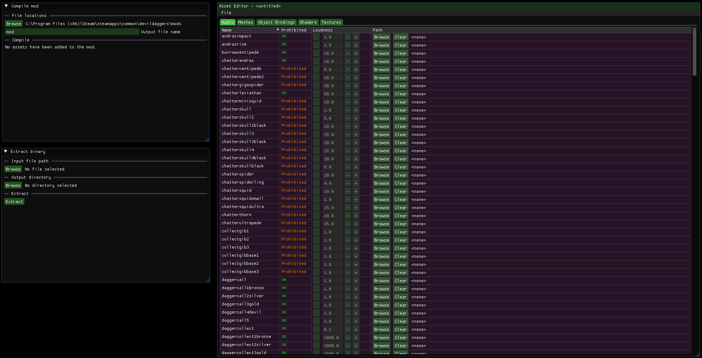

# Changelog

## [0.13.1.0] - 2024-04-03

### Asset Editor

- Texture coordinates and normals are now stored explicitly in extracted .obj files for compatibility with some 3D modeling software (e.g. Blender).

## [0.13.0.0] - 2024-04-03

### UI Improvements & Fixes

- Enabled window docking.
- Individual window locations, sizes, and docking settings are now stored in AppData and will be preserved for future updates.
- Whether the window is maximized is now cached properly.
- Moved editor menu bars to the top of the window.
- Fixed some shortcuts bugs while entering text in text fields.
- Fixed shortcuts like CTRL+A, CTRL+C, CTRL+V, and CTRL+X not working in text fields.

### Spawnset Editor

- Rewrote UI.
	- The spawns, settings, history, and topdown arena editor are now separate windows.
	- Arena shrink and brightness are now sliders instead of inputs.
	- Enemy combobox has been replaced with multiple buttons.
- The 3D camera now uses the same controls as the game's free camera.
- Fixed being able to select void tiles in the 3D arena editor.
- Fixed being able to add spawns with a negative delay.
- Fixed CTRL+A selecting all spawns even if the spawns window wasn't focused.
- Fixed various UI bugs.

### Mod Manager

- Added button to toggle all assets.
- Added button to toggle individual assets.
- Fixed not updating mod preview when selected mod is renamed, toggled, or deleted.
- Fixed not taking disabled assets into account when counting active assets.

### Replay Editor

- Completely rewrote the editor UI. The original UI has been split into two sections:
  - There is now a new editor which shows all the events in a timeline, making it easier to understand and edit the replay.
  - The original UI has been changed into a read-only events viewer that can be used to inspect the replay in more detail.

### Practice

- Renamed "Gigapedes" template to "Triple Gigapedes" for clarity.

### Asset Editor

- Fixed app getting stuck when compilation or extraction fails.
- Fixed not showing errors when mod compilation or extraction fails.

## [0.12.0.0] - 2024-01-21

### Asset Editor

The first version of the asset editor is now available.
- You can edit all the assets in the game and create `audio` and `dd` binaries.
- You can extract all the binaries from the game or from a mod.
- Loudness values for audio mods are supported as well.

More features will be added in the future.

### Practice

- Added popup when applying practice spawnset.
- Added "Do not show again" checkbox to practice popups. These are saved in the user settings.

### Replay Editor

- Added file extension filter to file dialogs. 

### Mod Manager

- Fixed toggling prohibited assets in the mod preview window not working.

### Miscellaneous

- The settings have been moved to the configuration screen.

## [0.11.0.0] - 2024-01-17

### Practice

- The practice tool has been made more intuitive.
  - Certain UI has been rearranged.
  - Clarified some of the button text.
  - There is now a popup that shows up when the normal game has been restored.
  - It is now shown whether practice is enabled in the bottom of the window.
  - It is now shown that you need to restart a run when changing the practice settings. 

### Fixes

- Fixed crash when trying to write to the mods/survival while the file is currently being used by another process (e.g. the game).
- Fixed incorrectly highlighting practice template after removing survival file.

### Miscellaneous

- Automatic updates have been removed due to anti-virus software not liking the way it was done. You will now have to manually download new versions from the GitHub releases page.
- URLs are now displayed when hovering over links.

## [0.10.3.0] - 2024-01-02

### Fixes

- Fixed requesting read/write permissions for files when only read permissions are needed.

## [0.10.2.1] - 2024-01-02

### Fixes

- Fixed app not starting due to incompatibility with optimized release.

## [0.10.2.0] - 2024-01-02

### Fixes

- Fixed error popups stacking.
- Fixed app crashing on start when not launching the executable from the root folder.
- Fixed rare instance of mod manager crashing the app while loading mod files.

### Miscellaneous

- Technical error details are now shown under a collapsible "Technical details" section in the error popups.

## [0.10.1.0] - 2024-01-01

### Miscellaneous

- Updated to .NET 8.0.
- Updated to latest ImGui.NET and Silk.NET versions.
- Now using faster JSON serialization when connecting to the web API.
- Added debug UI for keyboard input.
- Custom leaderboards encryption has been changed to allow distributing the app via GitHub releases.
- The releases can now be downloaded from the GitHub releases page. 

## [0.10.0.0] - 2023-11-13

### Mod Manager

Added mod manager. You can now manage installed mods in the mods folder.

#### Mods Folder Window

- All files from the mods folder are displayed, including mod type, file size, and information about their prohibited assets.
- The files can be filtered and sorted.
- The files can be enabled, disabled, renamed, and deleted.

#### Mod Preview Window

- Mod file contents can be previewed. All assets are displayed, including their type, size, and whether they are prohibited.
- Prohibited assets can be enabled and disabled.

#### Mod Installation Window

- A summary of the current mod installation is displayed.
- All effective assets are displayed, including their type, size, and whether they are prohibited.
- Whenever an asset is overridden by another mod, the mod that overrides it is displayed.

### Replay Editor

It is now possible to edit event data. This includes editing every piece of event data, as well as adding and removing events. The replay editor is still a work in progress.

- Hit events are explained in more detail in the UI.
- Replay preview timer and inputs visualization have been moved to the 3D window.
- Replay inputs have been moved to a separate tab. The input events themselves are now displayed in the same table as the other events.
- Fixed Thorn spawn events not being displayed correctly.
- Fixed not showing error when injecting replay into game memory fails.
- Fixed not appending `.ddreplay` to replay file name when saving.
- Fixed not detecting game memory when injecting or opening a replay the first time.
- Fixed crash when entities list navigation goes out of range.

### Spawnset Editor

- The spawnset editor now keeps track of unsaved changes and will ask you to save it when leaving the editor or opening a different spawnset.
- Added tooltip information to spawns headers.
- Changed spawns selection colors to make text more readable.
- Spawnset settings inputs no longer save a history state on every key press.

### Custom Leaderboards

- Fixed not clearing "View replay" buttons when selecting a different leaderboard.
- Added "Current spawnset" text to the displayed leaderboard if that spawnset is currently active.
- Performance improvements.

### Other

- Improved configuration layout.
- Fixed numpad enter key not registering.
- Fixed some keys getting stuck when opening file or folder dialogs.
- Pressing ESC now leaves the configuration window.
- Pressing ENTER now closes the message box.

## [0.9.1.0] - 2023-09-13

- Added menu item to replay editor to open the current local replay from game.
- Fixed practice window crashing when survival file was not yet loaded.

## [0.9.0.0] - 2023-08-29

### Spawnset Editor

- You can now select multiple tiles at once in the 3D arena editor.
- The spawnset editor now shows warnings when the end loop is too short or when the player spawn tile is void.
- The 3D arena editor is now only active when the window is focused.
- The spawnset editor window no longer loses focus when using undo/redo.
- Various other improvements to the 3D arena editor.

### Replay Editor

- Improved UI for current inputs.
- Replay file data is now displayed.
- Added event viewer. You can browse and filter events and view all the (known) data.
- Added entity viewer. You can browse and select entities. For now, only enemy HP logs are shown (which are still a work in progress).
- Added menu item to download and open a replay from the official leaderboards.
- Added menu item to inject the current replay into the game.

### Fixes

- Fixed occasional crash when opening the custom leaderboards tool.
- Fixed some textures being flipped incorrectly.
- Fixed some possible crashes.
- Fixed spawnset editor spawns selection not being cleared when using undo/redo.
- Fixed spawnset editor spawns selection not being cleared when switching to a different spawnset.
- Fixed 3D arena editor camera not stopping when the mouse leaves the window.
- Fixed tiles being edited in the 2D arena editor using arena tools when the window was not focused.
- Fixed tiles being edited in the 2D arena editor using scroll wheel when the window was not focused.
- Fixed arena tooltip being shown when the window was not focused.
- Fixed 3D arena editor not locking tiles while editing.

### Other

- Various performance improvements.

## [0.8.0.0] - 2023-08-20

- Added splits and graphs to practice tool.
- Various performance improvements.

## [0.7.3.0] - 2023-06-28

- Added ability to name and reorder custom practice templates.
- The practice window is now responsive.
- The practice buttons are now highlighted based on the currently active spawnset instead of what's inside the input fields.

## [0.7.2.0] - 2023-06-13

- Bug fixes.

## [0.7.1.0] - 2023-06-13

- Some UI fixes.

## [0.7.0.0] - 2023-06-13

- Rewrote main menu.
- Added 'about' window.
- Fixed incorrect additional gems for 'First Centipede' practice template.
- Effective hand and gems/homing values are now displayed in the practice window.
- Improved debug output.

## [0.6.4.0] - 2023-06-10

- Fixed some end loop practice templates starting too late which results in the first spawns being skipped.
- End loop practice templates now start earlier (0.1 sec after the last Squid II spawn of the previous wave). You can still manually change the timer start and save a custom template if the wait is too long.
- Improved styling for practice templates.

## [0.6.3.0] - 2023-06-09

- Added button to delete current spawnset to practice tool.
- The practice values for the currently active spawnset are now displayed for clarity.

## [0.6.2.0] - 2023-06-01

- Fixed some issues in the configuration screen layout.

## [0.6.1.0] - 2023-06-01

- Fixed end loop practice templates skipping the first spawns.

## [0.6.0.0] - 2023-05-31

### Practice tool

Added practice tool. You can now select a template to practice specific sections of the game without having to download custom spawnsets. The app will generate a spawnset on the fly based on the template.

No farm templates exist for various sections of the game, as well as end loop templates where you can fill in the homing value yourself.

You can create custom templates with your preferred homing values. Custom templates are automatically saved locally.

### App launcher

Removed the app launcher. The app is now able to update itself.

## [0.5.2.0] - 2023-05-22

- Added support for new custom leaderboards rank sortings.

## [0.5.1.2] - 2023-05-21

- Fixed sorting bug.

## [0.5.1.1] - 2023-05-21

- Rebuilt for API update.

## [0.5.1.0] - 2023-05-21

- Completely changed all the UI. The new system is much more flexible and easier to use.
- Added support for new custom leaderboards (gems, kills, homing).
- Added icon to executable file.
- Added options to delete and open the current survival.
- Bug fixes and improved logging.

## [0.4.2.0] - 2023-03-10

### Custom leaderboards

- Score difference with current highscore is now shown when not getting a highscore.
- Added button to reload all leaderboards.
- Bug fixes.

## [0.4.1.0] - 2023-03-05

### Custom leaderboards

- Improved custom leaderboard UI.
- Added spawnset and author filtering to custom leaderboard overview.
- Added checkbox to filter out leaderboards that are not featured.
- Added sorting to custom leaderboard overview.
- Player ID is now cached so you don't need to open the game to view your own rank, score, etc.
- Custom leaderboard pagination is now done client-side to improve performance and reduce network usage.

## [0.4.0.0] - 2023-02-28

- Added arena ellipse tool to spawnset editor.
- Added more settings for the arena editor.
  - Pencil
    - Size
  - Line
    - Width
  - Rectangle
    - Border size
    - Whether the rectangle should be filled
  - Race dagger
    - Snap to grid
- Changed arena shrink colors.
- Added controls and additional info text to 3D scenes.
- The arena editor tooltip is now transparent.
- Improved UI for survival editor height button and settings sections.
- Improved pencil, line, and race dagger editor tools and visualizations.
- Fixed arena tools being cancelled when the mouse leaves the arena.
- Fixed race dagger always being in the center of a tile in the 3D editor.
- Changes made in the 3D editor now affect the race dagger visualization.
- Reversed arena editor scroll controls.

## [0.3.0.0] - 2023-02-19

- Added application settings.
  - Scale UI to window
  - Show debug output
  - Render while window is inactive
  - Max FPS
  - Look speed
  - Field of view
- Improved 3D rendering.
  - Added lighting.
  - Improved shading.
  - Now using the actual Devil Daggers hand mesh and texture.
- Set up basic 3D tile editor (still work in progress).
- You can now go to the Replay Editor. For now you can only select a replay to view in 3D (this helps me with testing the simulation). You can also view the input visualization of the replay.
- Improved 3D replay simulation. It's still far from accurate (collisions, bhops, air control, and dagger jumps are missing).
- Improved custom leaderboards UI coloring.
- Fixed concurrency bug where the run would not upload when going to the menu too fast while the app is still waiting for the game to load memory stats and replay.
- Fixed incorrect accuracy difference in highscore result.
- Fixed performance issues.

## [0.2.3.0] - 2023-02-14

- Improved custom leaderboard upload result UI.
- Added application icon.

## [0.2.2.0] - 2023-02-13

- Highscore difference is now displayed.
- Fixed showing message box when playing an unknown spawnset.
- The (updated, in case of a highscore) leaderboard is now displayed after completing a run.

## [0.2.1.0] - 2023-02-12

- Improved custom leaderboard UI.
- Submission results are now displayed.
- Fixed occasional crash that could happen when opening the custom leaderboards screen while Devil Daggers is open.

## [0.2.0.4] - 2023-02-11

- Replaced COM interop with native file dialog library.

## [0.2.0.3] - 2023-02-10

- Fixed IL trimmer breaking JSON serialization.

## [0.2.0.2] - 2023-02-09

- Fixed more COM interop crashes.

## [0.2.0.1] - 2023-02-09

- Fixed COM interop crashes.

## [0.2.0.0] - 2023-02-09

- Added custom leaderboard criteria icons.
- Improved UI systems.
- Fixed a lot of bugs.
- Arena tools optimizations.
- Added all memory data to the custom leaderboard screen.
- Survival file change is now automatically detected by the custom leaderboards screen.
- Now using native file system and message box dialogs.
- Added directory picker to configuration screen.
- Replaced auto update functionality with separate launcher app.

## [0.1.0.0] - 2022-12-23

- Custom leaderboard support, including spawnset/leaderboard browsing/installation, score browsing, replay injecting, and a WIP 3D previewer for replays.
- More survival editor features including 3D viewer.
- Rewrote and improved most UI.
- New font.
- Fixed threading problems, performance is now 10x better.
- Auto update for future updates, just click button and new update will be downloaded and launched (still need to manually delete old files for now).
- Settings are saved to appdata (Windows).
- Fixed a lot of bugs.

## [0.0.0.0] - 2022-10-09

- Initial alpha release.
