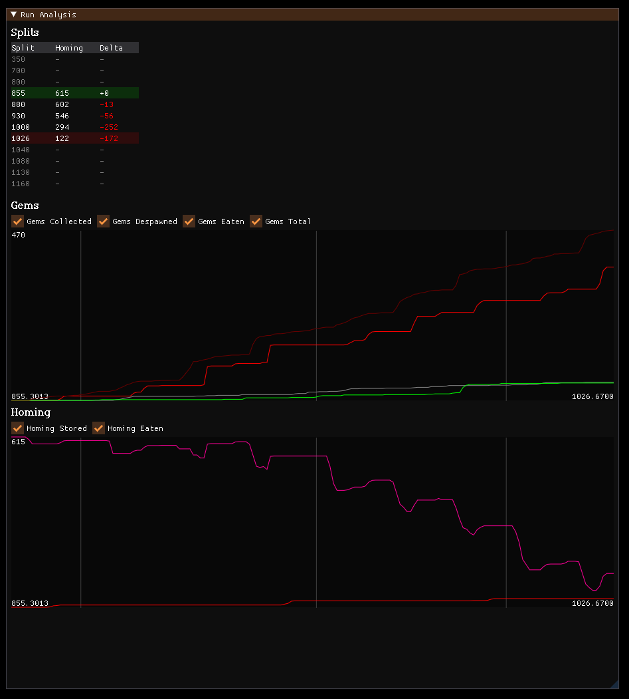
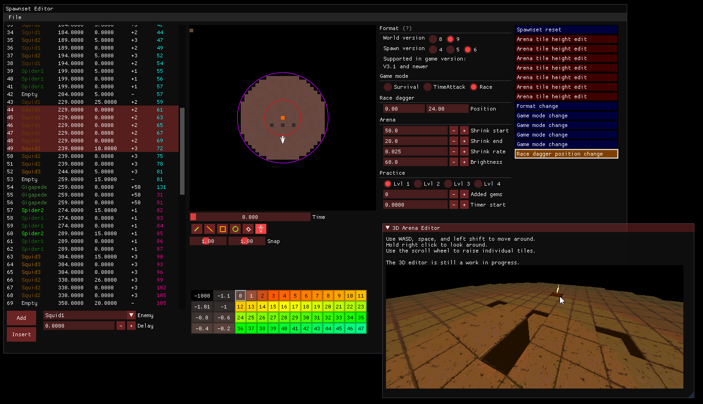
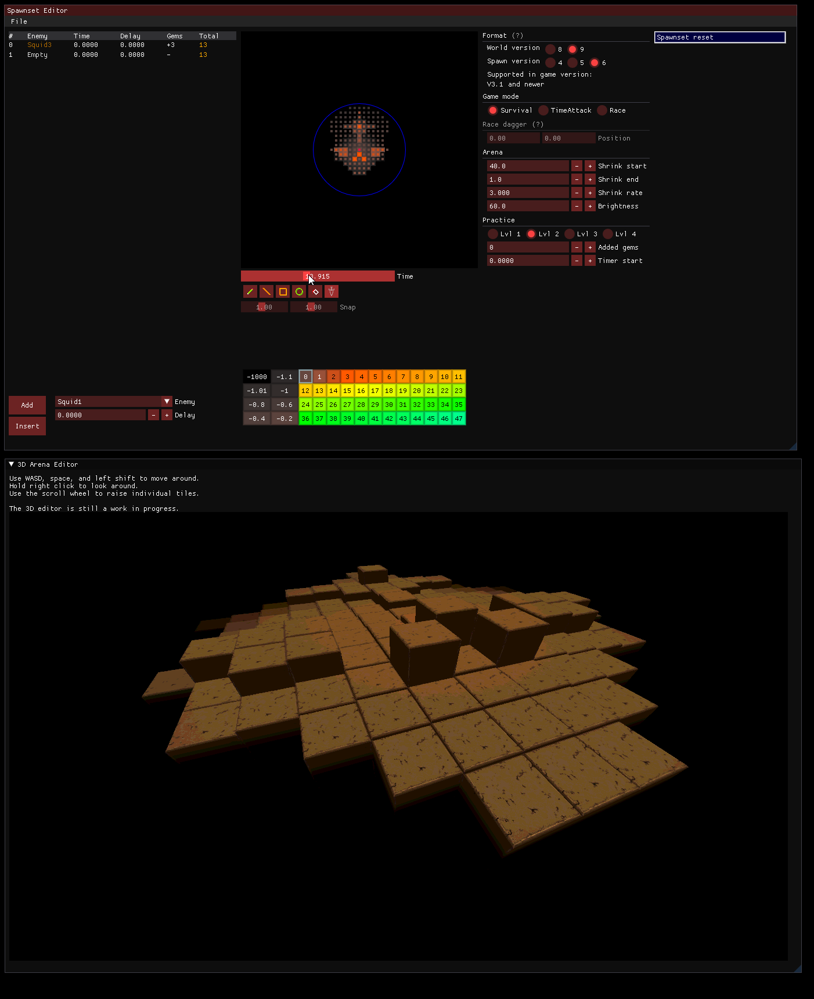
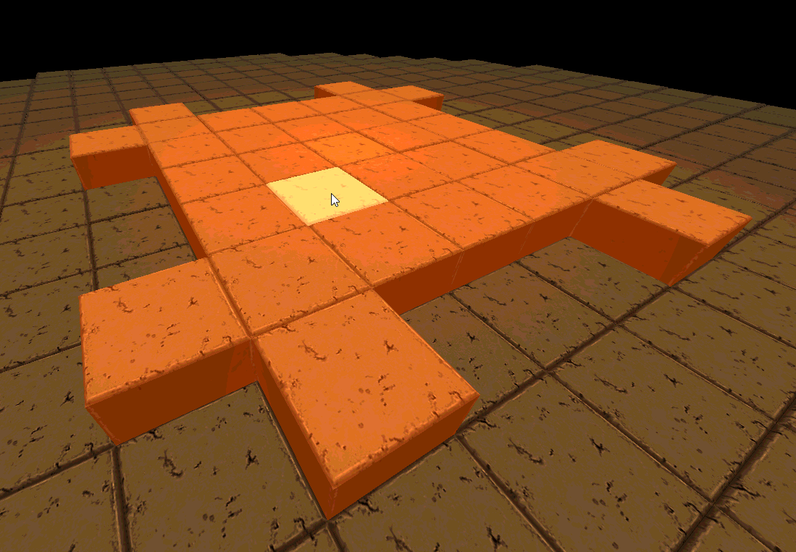
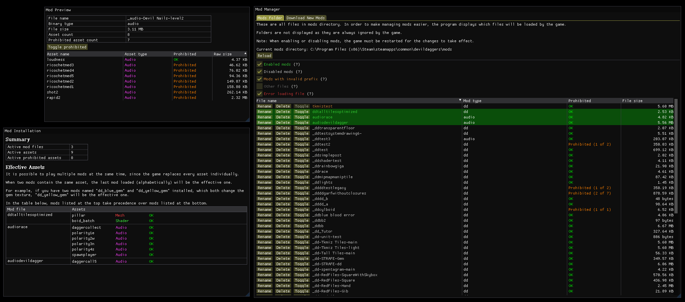
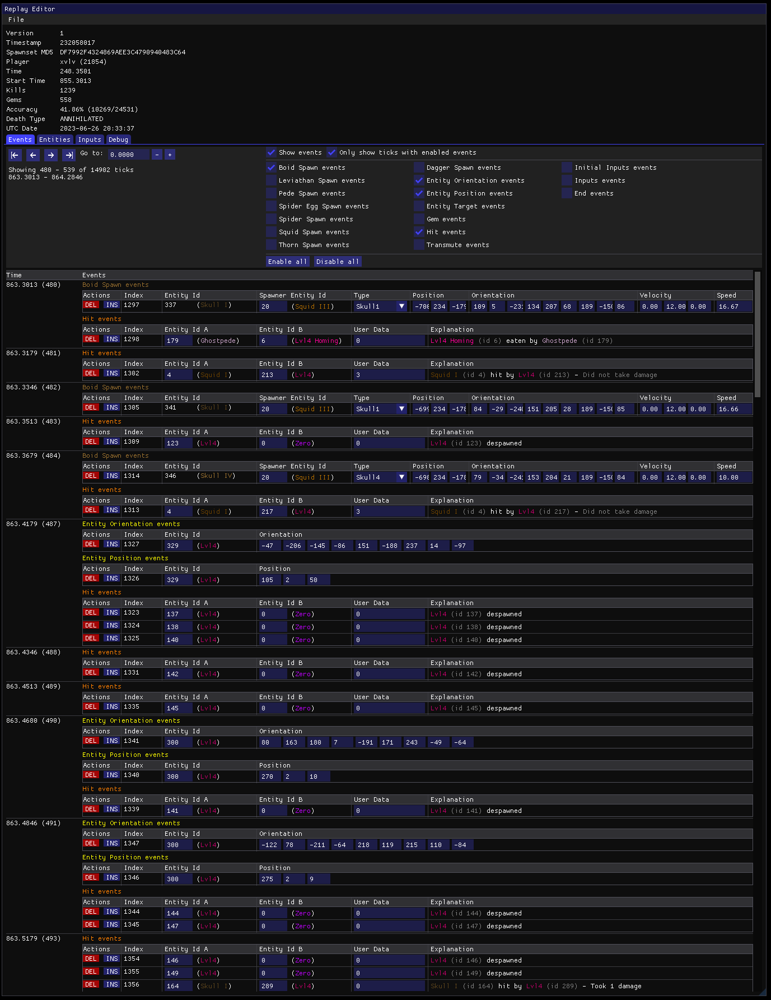
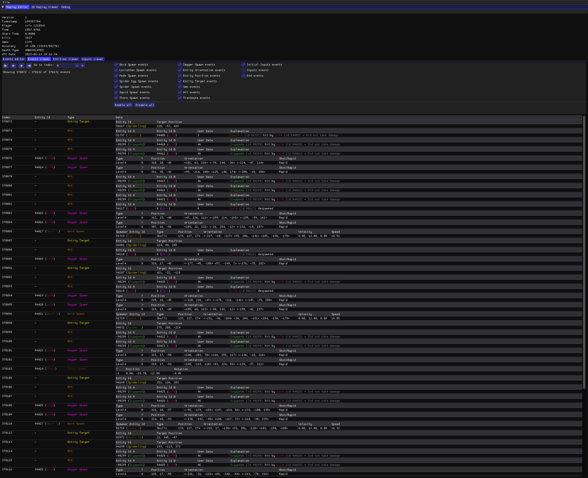

# ddinfo-tools

Cross-platform Devil Daggers modding tools, practice tools, and custom leaderboards client

## Features

The new tools are currently in development. The new app is a complete rewrite of the old Windows-only tools, combined into one app. It currently runs on Windows and Linux (some features are still missing on Linux for now).

### Practice mode

### Custom leaderboards client

### Spawnset (level) editor including a 3D editor

### Asset editor

### Mod manager

### Replay editor

## Other repositories

- [ddinfo-core](https://github.com/NoahStolk/ddinfo-core/) - core libraries for parsing spawnsets, mods, replays, and more
- [ddinfo-web](https://github.com/NoahStolk/ddinfo-web/) - website and web server at [devildaggers.info](https://devildaggers.info/)

### Deprecated tools

The original tools are not included in this repository. Visit these repositories:

- [Survival Editor](https://github.com/NoahStolk/DevilDaggersSurvivalEditor) - old Windows-only spawnset editor
- [Custom Leaderboards](https://github.com/NoahStolk/DevilDaggersCustomLeaderboards) - old Windows-only custom leaderboards client (no longer works)
- [Asset Editor](https://github.com/NoahStolk/DevilDaggersAssetEditor) - old Windows-only asset editor

## Running from source

1. Clone the repository.
2. Install [the .NET SDK](https://dotnet.microsoft.com/en-us/download/dotnet/8.0) version 8.0.x or later. The SDK is available for Windows, macOS, and Linux.
3. Run the project:
   - Execute `dotnet run --project src/DevilDaggersInfo.Tools/DevilDaggersInfo.Tools.csproj` from the command line.
   - Alternatively, you can open the `src/DevilDaggersInfo.Tools.sln` file in an IDE such as JetBrains Rider or Visual Studio and run the `DevilDaggersInfo.Tools` project.

## Disclaimer

While the project provides many ways to practice and modify the game, it does **not** allow you to cheat, or encourage cheating at all. You are also asked to not redistribute the game's assets, and only use them for modding purposes.

Most of these features have been discussed with the community and the developer of Devil Daggers (Sorath), some of which have been done in collaboration.

(Note: This code was originally part of the [DevilDaggersInfo](https://github.com/NoahStolk/ddinfo-web) repository (now ddinfo-web). It was moved to a separate repository on October 7th, 2023.)
