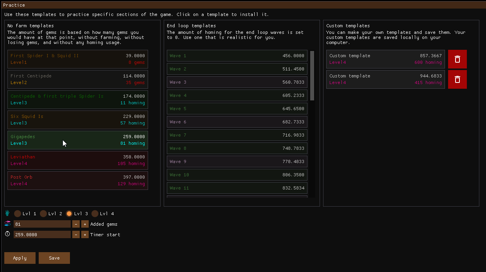

# ddinfo-tools

The DevilDaggersInfo project offers cross-platform tools to practice and mod the game, and to connect to custom leaderboards.

## Features

The new tools are currently in development. The new app is a complete rewrite of the old Windows-only tools, combined into one app. It currently runs on Windows and Linux (some features are still missing on Linux for now).

### Practice mode

### Custom leaderboards client

### Spawnset (level) editor including a 3D editor

### Replay editor (viewer for now)

### Planned features

These features are planned or in development:

- Replay previewer including input visualization
- Renewed spawnset manager
- Renewed asset editor for mods
- Renewed mod manager
- Replay previewer (and possibly editor)
- Replay enemy tracking

These features are planned but may not be possible to implement:

- Replay movement and the ability to compare speedrun/race replays using a ghost system in 3D

## Other repositories

- [ddinfo-core](https://github.com/NoahStolk/ddinfo-core/) - core libraries for parsing spawnsets, mods, replays, and more
- [ddinfo-web](https://github.com/NoahStolk/ddinfo-web/) - website and web server at [devildaggers.info](https://devildaggers.info/)

### Deprecated tools

The original tools are not included in this repository. Visit these repositories:

- [Survival Editor](https://github.com/NoahStolk/DevilDaggersSurvivalEditor) - old Windows-only spawnset editor
- [Custom Leaderboards](https://github.com/NoahStolk/DevilDaggersCustomLeaderboards) - old Windows-only custom leaderboards client (no longer works)
- [Asset Editor](https://github.com/NoahStolk/DevilDaggersAssetEditor) - old Windows-only asset editor

## Disclaimer

While the project provides many ways to practice and modify the game, it does **not** allow you to cheat, or encourage cheating at all. You are also asked to not redistribute the game's assets, and only use them for modding purposes.

Most of these features have been discussed with the community and the developer of Devil Daggers (Sorath), some of which have been done in collaboration.

(Note: This code was originally part of the [DevilDaggersInfo](https://github.com/NoahStolk/ddinfo-web) repository (now ddinfo-web). It was moved to a separate repository on October 7th, 2023.)
